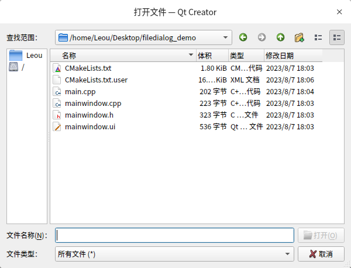
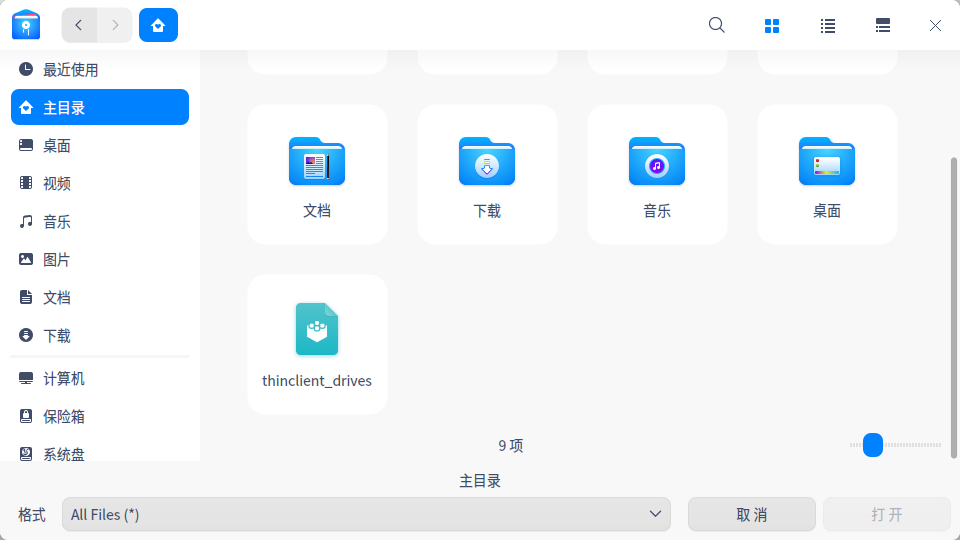
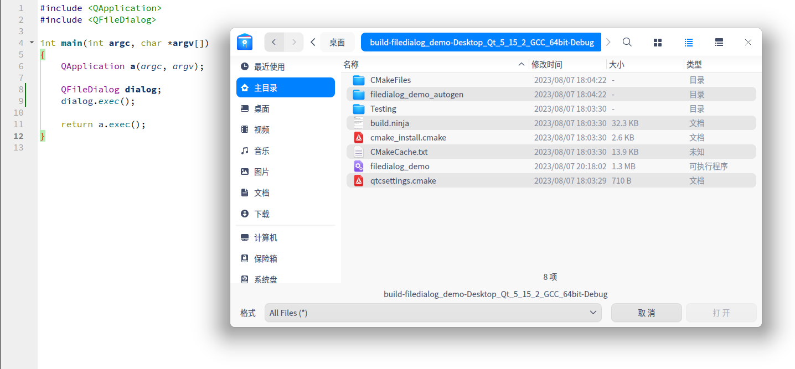

# Deepin-QFileDialog
用于 Qt 弹出 Deepin 或 UOS 风格的文件对话框。


Qt 官方版自身提供的文件对话框过于丑陋，与Deepin 或 UOS 系统UI界面不协调，期望能够调用Deepin 或 UOS 系统风格的文件对话框，实现UI风格一致。

Qt 提供的对话框：



而 Deepin 或 UOS 系统提供的默认对话框：




为了能实现调用UOS系统的文件对话框，有以下方案：
1. 使用DTK开发

    [DTK（Development ToolKit）](https://github.com/linuxdeepin/dtk)是UOS基于 Qt 开发的一整套简单且实用的通用开发框架，不过使用DTK将不能跨平台，同时依赖很多。

2. qt5integration

    [qt5integration](https://github.com/linuxdeepin/qt5integration/) 用于Deepin桌面环境的Qt平台主题集成插件。它包含多个QT5插件，以使DDE更加QT5应用程序友好。但是，qt5integration依赖很多，依赖于DTK（编译DTK是一件很痛苦的事情），无法作为独立的库使用。

3. Deepin/UOS 自带的Qt

    UOS自身维护了Qt 5.13的版本，并做了UOS风格化处理及相关优化。但由于UOS系统自带的Qt版本太低，与Qt 5.15.2 以上版本兼容性很差，且失去了跨平台能力，所以不考虑使用UOS维护的Qt版本。Deepin的Qt版本为5.15，版本较新，但同样不能跨平台，所以也不考虑。

所以，以上方案都不是最佳选择。这就是此仓库诞生的目的。本项目基于`qt5integration`进行的魔改，去掉了DTK等依赖，能够直接编译使用，完全独立的库，开箱即用，并且不需要更改任何代码。

## 下载代码

```
git clone https://github.com/L-Super/Deepin-QFileDialog.git
```

## 编译

```shell
mkdir build && cd build
cmake ..
make -j8
```
生成libqdeepin.so动态库路径
```
build/plugins/platformthemes/libqdeepin.so
```

## 使用

将生成的 libqdeepin.so 动态库拷贝到 Qt platformthemes 目录下，这样在 Qt Creator运行程序时，弹出的文件对话框就是Deepin/UOS风格的对话框。

```
/home/Leou/Qt/5.15.2/gcc_64/plugins/platformthemes/
```

示例代码：
```cpp
#include <QApplication>
#include <QFileDialog>

int main(int argc, char *argv[])
{
    QApplication a(argc, argv);

    QFileDialog dialog;
    dialog.exec();

    return a.exec();
}
```

效果：




打包发布程序时，将libqdeepin.so放入安装包结构目录 plugins/platformthemes下即可

```
├── lib
├── plugins
│   ├── bearer
│   ├── iconengines
│   ├── imageformats
│   ├── platforminputcontexts
│   ├── platforms
│   ├── platformthemes
│   └── xcbglintegrations
└── translations

```
